UD2 – PRÀCTICA 4

Marc Brines Bañuls 2 ASIX IAW

Abans de començar amb instal·lacions anem a actualitzar el server per si hi ha paquets a actualitzar nous.

*Fig 1: Update a la màquina server.*

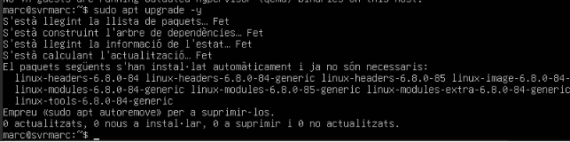

*Fig 2: Upgrade de la màquina*

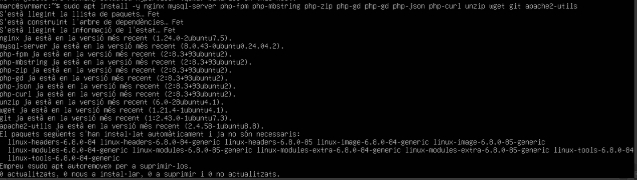

*Fig 3: Instal·lació de les ferramentes necesaries.*

*Fig 4: Ens asegurem de que funciona.*

*Fig 5: Agafem el usuari root i establim un tipus de contrasenya i una contrasenya.*

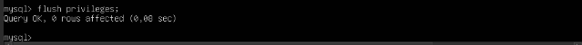

*Fig 6: Apliquem els canvis.*

*Fig 7: Verifiquem les pases anteriors.*

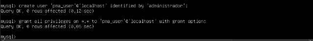

*Fig 8: Creem el usuari dedicat al phpMyAdmin.*

*Fig 9: Instal·lem el phpmyadmin i durant la instal·lació hem de sel·leccionar apache2.*

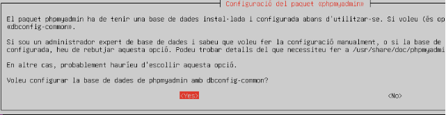

*Fig 10: Fiquem que si al pas de l’imatge.*

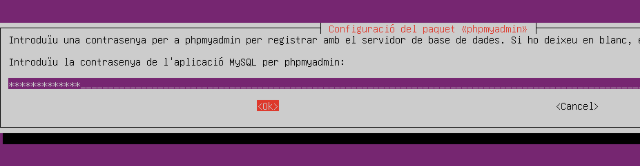

*Fig 11: Fiquem una contrasenya al phpmyadmin.*

Editem el fitxer de configuració del defaut, i enves de descomentar, he afegit el text següent per a previndre falles.

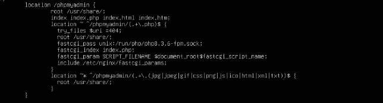

*Fig 12: Afegit al default*

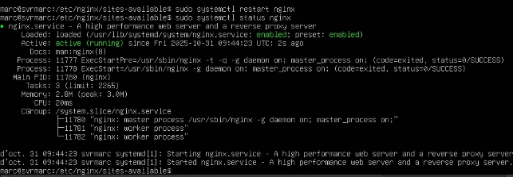

*Fig 13: Reiniciem el servici i comprovem.*

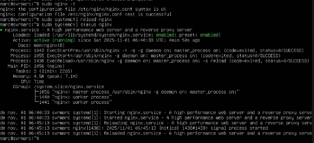

*Fig 14: Altra comprovacio de altra forma.*

Des d’altra màquina conectada a la red del server entrem al navegador per a comprovar que ha funcionat tota la configuració anterior i ens apareix la GUI de phpmyadmin.

*Fig 15: Comprovació.*

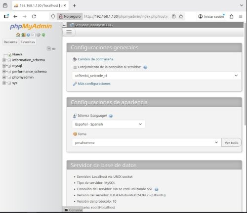

*Fig 16: Fiquem usuari root i contrasenya que hem establit abans.*

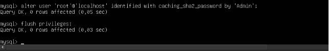

*Fig 17: Cambiem el metode de autenticació de root.*

*Fig 18: Comprovació.*

*Fig 19: Ara anem a crear un usuari per a gastar.* Després d’instal·lar el htpasswd anem a emmagatzemar credencials de dos usuaris.

*Fig 20: Fiquem dos usuaris.*

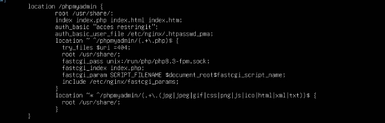

*Fig 21:  Editem el site de nginx i afegim la 4 i 5 línea.*

Una  vegada  acabem  fem  per  terminal  es  següent  comandament,  i  per  a  comprovar  anem  al phpmyadmin GUI i recarreguem on deuria de demanar-nos noves credencials.

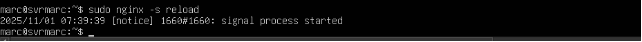

*Fig 22: Carreguem el nginx.*

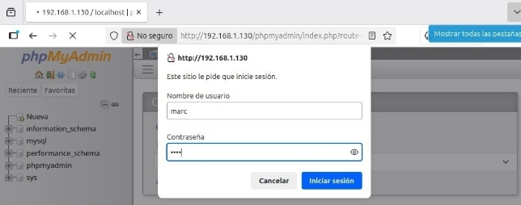

*Fig 23: Iniciem amb el nou usuari que hem guardat anteriorment.*

*Fig 24: Afegim seguretat al fitxer de la contrasenya.*

Ara anem a fer una guia també pas a pas per a pujar aquest projecte al github pages com feem anteriorment, com sempre, abans de res anem a crear el repositori a github.

*Fig 25: Creació del repositori.*

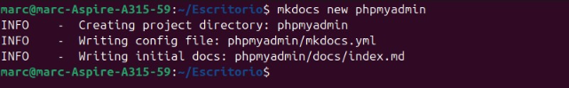

*Fig 26: Creació del directori.*

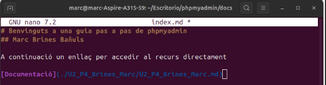

*Fig 27: Creació del index.*

Marc Brines Bañuls 10 ASIX IAW

10

*Fig 28: Inicialització del repositori.*

***Falta el git add . Que no m’he donat conter de la captura i el commit.***

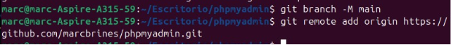

*Fig 29: Pujem la branca i conectem repositori.*

*Fig 30: Pujem el fitxer. I fem un mkdocs gh-deploy per a les pages.*

Com durant la instal·lació no he fet servir els scripts ja que no se fer-los i per no copiar directament, ja que he seguit els pases de la web, vaig a ficar al mkdocs un enllaç on durà a escripts que diu la pràctica per a automatitzar punts de la instl·lació i configuració.
Marc Brines Bañuls 1 ASIX IAW

1
